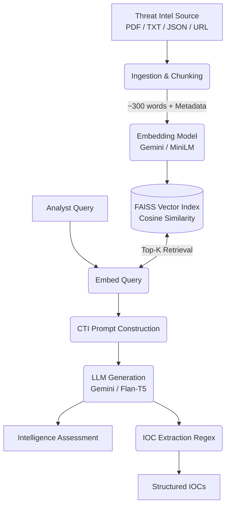

<div align="center">

# 🛡️ CTI-RAG: Cyber Threat Intelligence Q&A

[](https://python.org)
[](https://github.com/facebookresearch/faiss)
[](https://deepmind.google/technologies/gemini/)
[](LICENSE)

*A Retrieval-Augmented Generation (RAG) assistant for querying cybersecurity threat reports, CISA advisories, and CVE feeds using natural language.*

[Features](#-key-features) • [Architecture](#-architecture) • [Getting Started](#-getting-started) • [Usage](#-usage)

</div>

---

## 🎯 Overview

**CTI-RAG** transforms unstructured cyber threat intelligence into an interactive, queryable knowledge base. Designed specifically for security analysts, this system allows you to feed it real-world threat reports (PDFs, TXT, JSON CVEs, or direct URLs) and query them using natural language. 

Built from scratch—without heavy abstraction frameworks like LangChain—it prioritizes performance, transparency, and explicit extraction of Indicators of Compromise (IOCs).

---

## ✨ Key Features

- 📄 **Multi-Format Ingestion:** Seamlessly parse PDFs, Text files, NVD JSON CVE feeds, and direct HTML/PDF URLs.
- 🔗 **Source Attribution:** Every chunk of text carries its source file name and ingestion timestamp, ensuring analysts can always trace claims back to the original report.
- 🎯 **Automated IOC Extraction:** Built-in regex pipelines automatically extract and surface:
  - CVE Identifiers
  - IPv4 Addresses
  - MD5 / SHA256 Hashes
  - Malicious Domains
  - MITRE ATT&CK Technique IDs
- 🧠 **CTI-Tuned Generation:** The underlying LLM is prompted specifically to act as a threat analyst, prioritizing MITRE ATT&CK mappings, threat actor attributions, and defensive mitigations.
- 🌱 **Seed Corpus:** Includes an automated script (`scripts/seed_corpus.py`) to download real-world CISA advisories and MITRE reports to bootstrap your testing environment.
- 🖥️ **Interactive Web UI:** Features a sleek Gradio-based interface for uploading documents, pasting URLs, and viewing extracted IOCs alongside generated assessments.

---

## 🏗️ Architecture



## 🛠️ Tech Stack

| Component | Technology | Description |
| :--- | :--- | :--- |
| **Ingestion** | `PyMuPDF`, `urllib` | Fast PDF and web scraping |
| **Embeddings** | `google-genai`, `sentence-transformers` | Gemini Embedding API (3072-dim) or local MiniLM (384-dim) |
| **Vector Store** | `FAISS` | Facebook AI Similarity Search (IndexFlatIP) |
| **LLM Generation** | `Gemini 2.5 Flash`, `Flan-T5` | High-speed cloud generation with local CPU fallback |
| **UI** | `Gradio` | Interactive web interface |

---

## 🚀 Getting Started

### 1. Prerequisites
Ensure you have Python 3.9+ installed.

```bash
# Clone the repository
git clone https://github.com/Aaarya2117/RAG_Document_QA.git
cd RAG_Document_QA

# Install required dependencies
pip install -r requirements.txt
```

### 2. Configuration & API Keys
The project uses the Gemini API by default for high-quality embeddings and generation.

```bash
export GEMINI_API_KEY="your_gemini_api_key_here"
```

*(Optional)* For a completely local, offline, and key-free deployment, edit `config.yaml`:
```yaml
generation_provider: "local"
generation_model: "google/flan-t5-small"
```

### 3. Bootstrap the Corpus
Download a sample set of real-world threat reports (MITRE ATT&CK, NIST IR, FBI IC3):
```bash
python scripts/seed_corpus.py
```

---

## 💻 Usage

### Launch the Web UI
The easiest way to interact with CTI-RAG is via the web interface.
```bash
python src/app.py
```
*Navigate to `http://localhost:7860` in your browser.*

### Command-Line Interface
For terminal-based interaction:
```bash
python src/pipeline.py
```

### Example Queries
Try these out once you have ingested a threat report:
> 🗣️ *"What TTPs does APT29 use for lateral movement?"*  
> 🗣️ *"Which CVEs in this advisory affect Windows Server?"*  
> 🗣️ *"What IOCs are associated with the Lazarus Group?"*  
> 🗣️ *"What MITRE ATT&CK techniques are used for credential access?"*  
> 🗣️ *"What defensive mitigations are recommended against LOTL techniques?"*

---

## 📂 Project Structure

```text
CTI-RAG/
├── config.yaml                 # Core configuration (chunking, models, paths)
├── requirements.txt            # Python dependencies
├── scripts/
│   └── seed_corpus.py          # Auto-downloads public threat intel PDFs
├── src/
│   ├── ingest.py               # Document loading, chunking, and metadata tagging
│   ├── ioc_extractor.py        # Regex-based IOC extraction engine
│   ├── embeddings.py           # Vector embedding and FAISS index management
│   ├── retriever.py            # Cosine similarity search implementation
│   ├── generator.py            # Multi-provider LLM generation & CTI prompting
│   ├── pipeline.py             # End-to-end RAG pipeline wiring
│   └── app.py                  # Gradio Web UI implementation
├── data/
│   ├── documents/              # Storage for raw threat reports (PDF, TXT, JSON)
│   ├── index/                  # Serialized FAISS index and chunk metadata
│   └── eval_qa.json            # Benchmark Q&A pairs for automated evaluation
└── results/
    └── eval_results.json       # Generated evaluation metrics
```

---
*Built for Security Analysts. Grounded in Threat Intelligence.*
