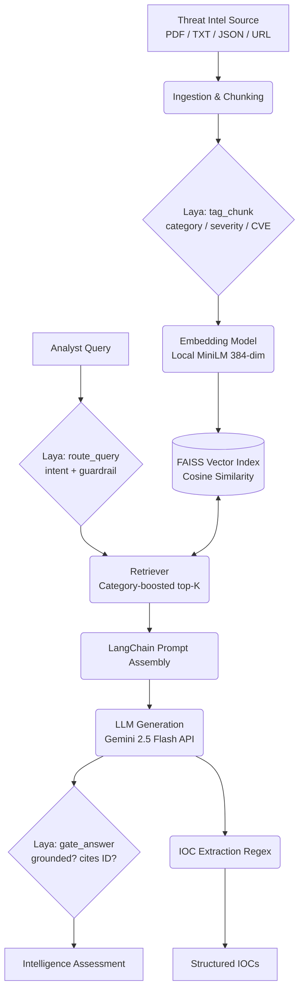

<div align="center">

# 🛡️ CTI-RAG: Cyber Threat Intelligence Q&A

[](https://python.org)
[](https://github.com/facebookresearch/faiss)
[](https://deepmind.google/technologies/gemini/)
[](LICENSE)

*A Retrieval-Augmented Generation (RAG) assistant for querying cybersecurity threat reports, CISA advisories, and CVE feeds using natural language.*

[Features](#-key-features) • [Architecture](#-architecture) • [Getting Started](#-getting-started) • [Usage](#-usage)

</div>

---

## 🎯 Overview

**CTI-RAG** transforms unstructured cyber threat intelligence into an interactive, queryable knowledge base. Designed specifically for security analysts, this system allows you to feed it real-world threat reports (PDFs, TXT, JSON CVEs, or direct URLs) and query them using natural language. 

The pipeline uses **LangChain Expression Language (LCEL)** for orchestration, a local typed-decision model (**Laya**) for chunk tagging, query intent routing, and answer citation gating, local **MiniLM** embeddings with **FAISS**, and **Google Gemini 2.5 Flash** for high-quality threat intelligence assessments.

---

## ✨ Key Features

- 📄 **Multi-Format Ingestion:** Seamlessly parse PDFs, Text files, NVD JSON CVE feeds, and direct HTML/PDF URLs.
- 🏷️ **Laya Typed Decisions:** Local classification and guardrails for category tagging, query intent routing, and citation/grounding gating.
- 🔗 **Source Attribution:** Every chunk of text carries its source file name, timestamp, and Laya semantic tags.
- 🎯 **Automated IOC Extraction:** Built-in regex pipelines automatically extract CVEs, IPv4s, Hashes, Domains, and MITRE IDs.
- 🧠 **CTI-Tuned Generation:** Generates comprehensive intelligence assessments using **Gemini 2.5 Flash** with strict grounding rules.
- ⚡ **Resource Constrained:** Optimized for CPU-only machines (e.g. 8GB RAM) with zero local generative weights.
- 🖥️ **Interactive Web UI:** Features a sleek Gradio-based interface for uploading documents and analyzing reports.

---

## 🏗️ Architecture



## 🛠️ Tech Stack

| Component | Technology | Description |
| :--- | :--- | :--- |
| **Orchestration** | `LangChain` / `LCEL` | Composable runnable pipeline |
| **Typed Decisions** | `Laya` (421M, CPU) | Chunk tagging, query intent routing, and answer gating |
| **Ingestion** | `PyMuPDF`, `urllib` | Fast PDF and web scraping |
| **Embeddings** | `sentence-transformers` | Local MiniLM (`all-MiniLM-L6-v2`, 384-dim) |
| **Vector Store** | `FAISS` | Facebook AI Similarity Search (IndexFlatIP) |
| **LLM Generation** | `Gemini 2.5 Flash` | Hosted cloud generation via `ChatGoogleGenerativeAI` |
| **UI** | `Gradio` | Interactive web interface |


---

## 🚀 Getting Started

### 1. Prerequisites
Ensure you have Python 3.9+ installed.

```bash
# Clone the repository
git clone https://github.com/Aaarya2117/CTI-RAG.git
cd CTI-RAG

# Install required dependencies
pip install -r requirements.txt
```

### 2. Configuration & API Keys
The project uses the Gemini API by default for high-quality generation.

```bash
export GEMINI_API_KEY="your_gemini_api_key_here"
```

*(Optional)* For a completely local, offline, and key-free deployment, edit `config.yaml`:
```yaml
generation_provider: "local"
generation_model: "google/flan-t5-small"
```

### 3. Bootstrap the Corpus
Download a sample set of real-world threat reports (MITRE ATT&CK, NIST IR, FBI IC3):
```bash
python scripts/seed_corpus.py
```

---

## 💻 Usage

### Launch the Web UI
The easiest way to interact with CTI-RAG is via the web interface.
```bash
python src/app.py
```
*Navigate to `http://localhost:7860` in your browser.*

### Command-Line Interface
For terminal-based interaction:
```bash
python src/pipeline.py
```

### Automated Benchmark Evaluation
Run regression evaluation across standard CTI benchmark queries:
```bash
python src/evaluate.py
```

### Example Queries
Try these out once you have ingested a threat report:
> 🗣️ *"What TTPs does APT29 use for lateral movement?"*  
> 🗣️ *"Which CVEs in this advisory affect Windows Server?"*  
> 🗣️ *"What IOCs are associated with the Lazarus Group?"*  
> 🗣️ *"What MITRE ATT&CK techniques are used for credential access?"*  
> 🗣️ *"What defensive mitigations are recommended against LOTL techniques?"*

---

## 📂 Project Structure

```text
CTI-RAG/
├── config.yaml                 # Core configuration (chunking, models, providers, paths)
├── requirements.txt            # Python dependencies (LangChain, Laya, FAISS, PyTorch CPU)
├── scripts/
│   └── seed_corpus.py          # Auto-downloads public threat intel PDFs
├── src/
│   ├── laya_layer.py           # Laya typed-decision layer (tagging, routing, citation gating)
│   ├── ingest.py               # Document loading, chunking, and Laya metadata tagging
│   ├── ioc_extractor.py        # Regex-based IOC extraction engine
│   ├── embeddings.py           # Local MiniLM vector embeddings and FAISS index management
│   ├── retriever.py            # Cosine similarity search with Laya intent category boosting
│   ├── generator.py            # LangChain multi-provider generation (Gemini, OpenRouter, local)
│   ├── pipeline.py             # LangChain LCEL end-to-end pipeline wiring
│   ├── evaluate.py             # Automated benchmark evaluation harness
│   └── app.py                  # Gradio Web UI implementation with Laya decision telemetry
├── data/
│   ├── documents/              # Storage for raw threat reports (PDF, TXT, JSON)
│   ├── index/                  # Serialized FAISS index (384-dim) and chunk metadata
│   └── eval_qa.json            # Benchmark Q&A pairs for automated evaluation
└── results/
    └── eval_results.json       # Generated evaluation metrics
```

---
*Built for Security Analysts. Grounded in Threat Intelligence.*
